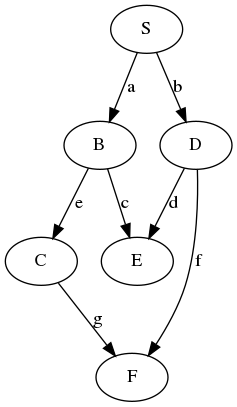

# GraphLib

Graph library

Implementation of different graph algorithms and representations.

Minimalistic pure-python graph algorythms implementation

Implemented algorytms:
* DFS
* BFS
* Dijkstra
* Bellman-Ford
* Topological sort

Example:  
Find shortest paths for given graph from vertex S:  
  
```
from core.algorithms import dijkstra
from core.graphs import create_graph, Node


def create_test_graph():
    graph = create_graph(directed=True)
    nodeS = Node("S")
    nodeB = Node("B")
    nodeD = Node("D")
    nodeE = Node("E")
    nodeC = Node("C")
    nodeF = Node("F")

    graph.add_node(nodeS)
    graph.add_node(nodeB)
    graph.add_node(nodeD)
    graph.add_node(nodeE)
    graph.add_node(nodeC)
    graph.add_node(nodeF)

    graph.add_edge("S", "B")
    graph.add_edge("S", "D")
    graph.add_edge("B", "E")
    graph.add_edge("D", "E")
    graph.add_edge("B", "C")
    graph.add_edge("D", "F")
    graph.add_edge("C", "F")
    return graph


if __name__ == '__main__':
    graph = create_test_graph()
    walks = dijkstra(graph, "S")
    for v, w in walks.items():
        print(f"{v}: {w}\tweight: {w.weight}")
```
Output:
```
E: S -> (a) -> B -> (c) -> E	weight: 2
F: S -> (b) -> D -> (f) -> F	weight: 2
C: S -> (a) -> B -> (e) -> C	weight: 2
B: S -> (a) -> B	weight: 1
D: S -> (b) -> D	weight: 1
S: S	weight: 0
```


# Dependencies
https://graphviz.org/download/

Graphviz

```
sudo apt install graphviz
```